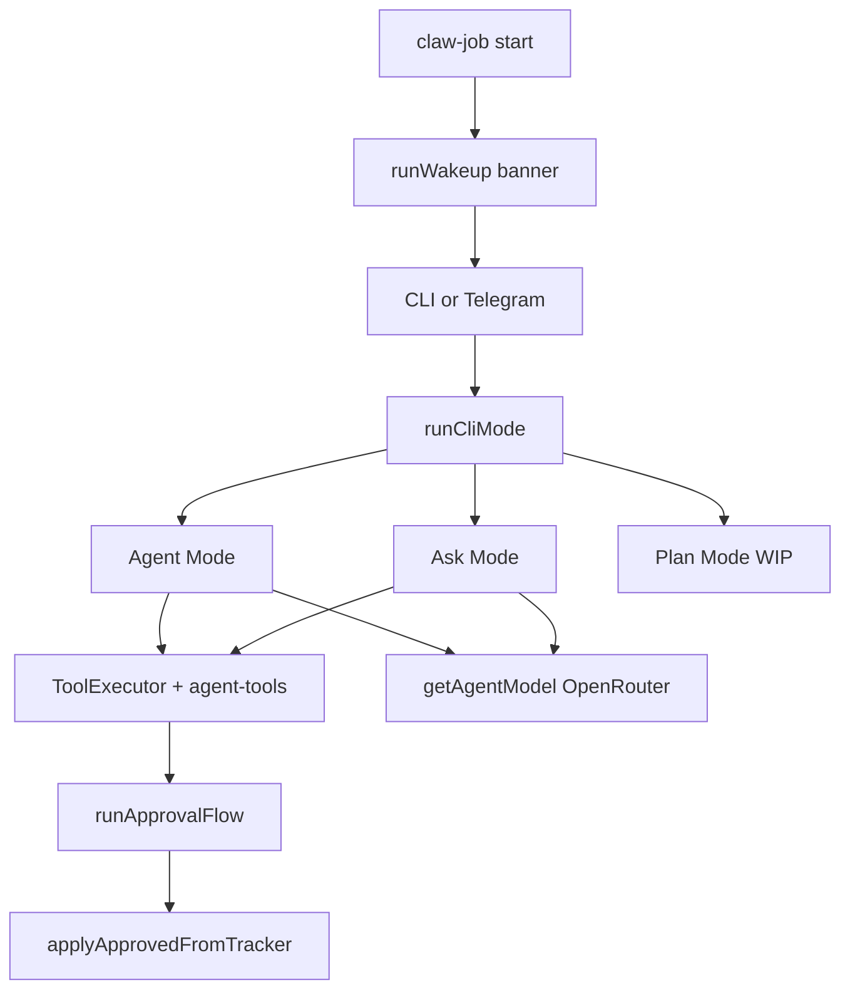

# OpenClaw CLI (`claw-job`)

A terminal-based desktop automator that uses an LLM agent to read, search, and stage changes to your local codebase — with user approval before anything is applied.

## What we're building

OpenClaw CLI is the interactive front-end of the OpenClaw monorepo. It gives you a guided terminal experience for AI-assisted work on your machine.

- **Interactive CLI** — Commander entrypoint, Clack prompts, and a Figlet banner on startup
- **Agent mode** — Task-oriented agent (Vercel AI SDK `ToolLoopAgent`) that can read and explore your workspace, stage file/folder/shell changes, and apply them only after you approve
- **Ask mode** — Q&A with read and shell tools; optionally save the answer to a `.md` file (with approval)
- **Plan mode** — Coming soon (menu entry exists, not yet implemented)
- **Telegram mode** — Coming soon (placeholder in the main menu)

## Architecture



## Agent capabilities

All file and shell mutations are **staged first** and applied only after you approve them in the review flow.

| Tool | Purpose |
|------|---------|
| `read_file` | Read workspace files |
| `create_file` / `modify_file` / `delete_file` | Staged file mutations |
| `create_folder` | Staged directory creation |
| `list_files` / `search_files` | Explore the codebase |
| `analyze_codebase` | Structure summary (counts, extensions) |
| `execute_shell` | Staged shell commands (run after approval) |
| `list_skills` / `read_skill` | Cursor / Claude skill files |

The workspace root defaults to `process.cwd()`. **Run the CLI from the project directory you want the agent to work in.**

## Prerequisites

- [Bun](https://bun.com) 1.3+ (project uses `bun@1.3.3`)
- [OpenRouter](https://openrouter.ai) API key

## Setup

```bash
# From monorepo root
cd openclaw
bun install

# Configure environment
cd apps/cli
cp .env.example .env
# Edit .env and add your OpenRouter API key
```

Required environment variables:

```env
OPENROUTER_API_KEY=your-key-here
OPENROUTER_DEFAULT_MODEL=openrouter/free
```

Bun loads `.env` from the **current working directory**. If you run from another folder, the API key may not be picked up. Always run from `apps/cli` or pass `--env-file` explicitly.

## How to start

```bash
# Recommended: from apps/cli
cd openclaw/apps/cli
bun run src/index.ts start

# Via package bin (after workspace install / bun link)
claw-job start

# From anywhere, with explicit env file
bun --env-file=apps/cli/.env apps/cli/src/index.ts start
```

### Interactive flow

1. Run `claw-job start` (or `bun run src/index.ts start`)
2. Select **CLI** at the main menu
3. Choose **Agent**, **Ask**, or **Plan**
4. Enter your task or question
5. Review staged actions and approve or reject

**Agent mode** — Give a concrete task (e.g. "add a health check endpoint"). The agent explores the repo, stages changes, and waits for your approval before writing files or running shell commands.

**Ask mode** — Ask a question. You can optionally save the answer as a `.md` file in the current directory (also requires approval).

## Project structure

```
apps/cli/
├── src/
│   ├── index.ts          # claw-job CLI entry
│   ├── wakeup.ts         # banner + top-level mode picker
│   ├── ai/ai.config.ts   # OpenRouter model setup
│   └── modes/
│       ├── cli.ts        # sub-mode router
│       ├── agent/        # agent loop, tools, approval
│       └── ask/          # ask + optional md export
├── .env                  # local secrets (gitignored)
├── .env.example          # template for required env vars
└── package.json          # bin: claw-job
```

## Tech stack

- **Runtime:** Bun + TypeScript
- **CLI:** Commander, @clack/prompts, chalk, figlet
- **AI:** Vercel AI SDK (`ai`) + OpenRouter provider
- **Rendering:** marked + marked-terminal for markdown in the terminal

## Troubleshooting

| Problem | Fix |
|---------|-----|
| `OPENROUTER_API_KEY` missing | Run from `apps/cli`, or use `bun --env-file=apps/cli/.env` |
| Agent makes no changes | You may have rejected approval, or the agent staged no actions |
| Wrong project was edited | Workspace root is `process.cwd()` — `cd` into the target repo before starting |
| Plan / Telegram does nothing | Those modes are not implemented yet |

## License

Private — part of the OpenClaw monorepo.
